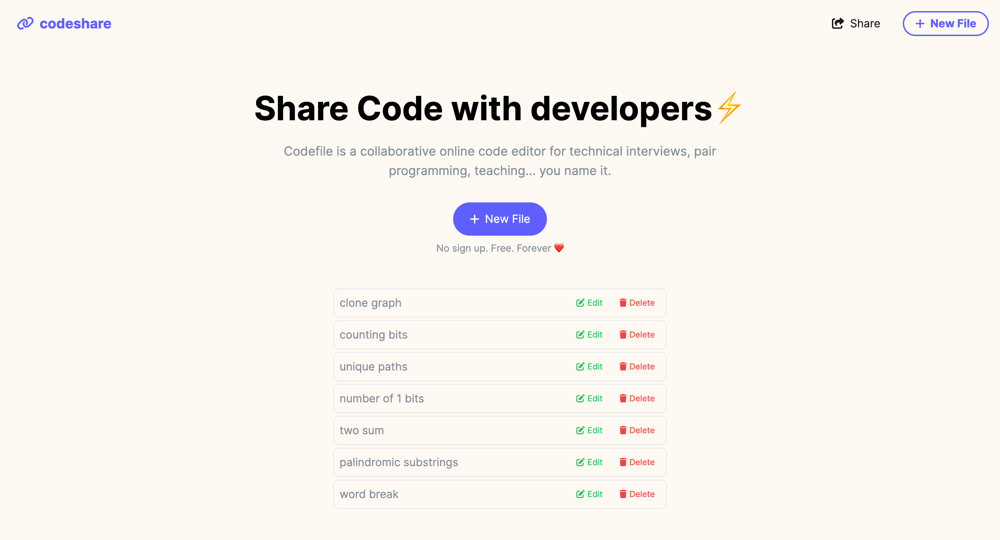
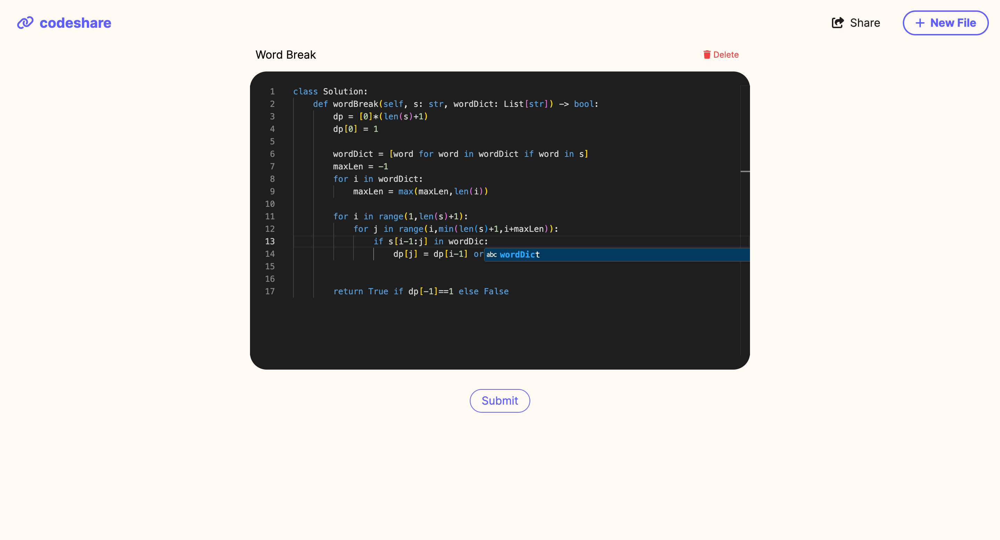

# CodeShare

CodeShare is an innovative online tool built using Next.js and Tailwind for developers to easily share code snippets with others. Whether you're collaborating with a team or seeking feedback from friends, CodeShare provides a seamless platform to create, edit, and manage your code snippets.


## Features

- **Create and Share Snippets**: Effortlessly create code snippets and share them via hosted links.

- **Edit and Delete**: Modify or remove your snippets with a user-friendly interface.

- **Prisma Client Integration**: Utilizes Prisma Client for robust and efficient data management.

- **Optimized Performance**: Implements best practices like server actions, route caching, and optimal use of server and client components.

- **Code Editor**: Includes a fully-featured code editor from VS Code, supporting dark mode, line numbering, autocomplete and much more for an enhanced coding experience.

- **Dynamic Paths and Custom Not Found Pages**: Supports dynamic URL paths and personalized 404 error pages for better navigation and user experience.

- **Automatic Loading Spinners**: Enhances the user experience with visual loading indicators.

- **Form Validation and Error Handling**: Ensures reliable form submission with robust validation and error handling mechanisms.

- **Efficient Caching**: Employs a comprehensive route caching system to improve performance and ensure up-to-date data display.

## Demo

**Home**: Lists the code snippets you created



**Edit**: Offers a responsive code editor to make changes in the code.





## How to Use in Local

1. **Clone the Repository**:
    ```bash
    git clone https://github.com/sheel-ui/codeshare.git
    ```
    
2. **Install Dependencies**:
    ```bash
    cd codeshare
    npm install
    ```

3. **Setup Environment Variables**:
    Create a `.env` file in the root directory and add your environment variables.

4. **Run the Development Server**:
    ```bash
    npm run dev
    ```

5. **Open Your Browser**:
    Go to `http://localhost:3000` to start using CodeShare.

## How to Use in Local

To share the code online, deploy the application using the steps mentioned [here](https://vercel.com/new).

## Contributing

Contributions are welcome! Please fork the repository and submit a pull request for any improvements or bug fixes.

## License

This project is licensed under the MIT License.


Thank you for using CodeShare!
